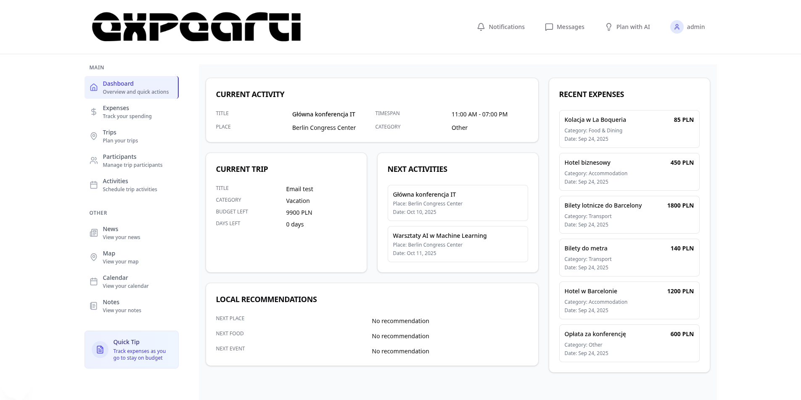

<div align="center">
   
   <br/>
   <h1>your trips budget manager</h1>
   <br/>
   <!-- Badges -->
   <a href="https://nodejs.org/"></a>
   <a href="https://nestjs.com/"></a>
   <a href="https://nextjs.org/"></a>
   <a href="https://www.postgresql.org/"></a>
   <a href="https://redis.io/"></a>
   <a href="https://kubernetes.io/"></a>
   <a href="https://helm.sh/"></a>
   <a href="#"></a>
</div>

A full-stack application for managing vacation budgets, trip expenses, and participant coordination. Built with NestJS backend, Next.js frontend, and Kubernetes-ready deployment infrastructure.



## Features

- **Expense Tracking**: Track expenses across different categories
- **Trip Management**: Create and manage vacation trips with detailed planning
- **Participant Management**: Manage trip participants with roles and responsibilities
- **Activity Planning**: Plan and track trip activities with scheduling
- **Currency Support**: Multi-currency support with real-time exchange rates
- **Payment Management**: Track payments and settlements between participants
- **Email Notifications**: Automated email notifications for participants
- **Data Export**: Generate reports and summaries for trips and expenses

## Architecture

- **Backend**: NestJS API with TypeScript
- **Frontend**: Next.js with React and TypeScript
- **Database**: PostgreSQL with Prisma ORM
- **Cache**: Redis for session management and caching
- **Queue**: BullMQ for background job processing
- **Infrastructure**: Kubernetes with Helm charts for deployment
- **ERD**: [PostgreSQL Diagram on drawSQL](https://drawsql.app/teams/wsparcie/diagrams/budzetownik/embed)

## Launch


### Quick Start with Docker

1. **Clone and setup environment**
   ```bash
   git clone <repository-url>
   cd <repository-name>

   # Setup backend environment
   cd backend
   cp .env.example .env
   # Edit .env file with your values (see Environment Variables section below)
   cd ..

   # Setup frontend environment
   cd frontend
   cp .env.example .env.local
   # Edit .env.local file with your values
   cd ..
   ```

2. **Build and start all services**
   ```bash
   docker compose up --build
   ```

3. **Access the application**
   - Frontend: http://localhost:5002
   - Backend API: http://localhost:5001
   - API Documentation: http://localhost:5001/api

### Development Setup (Local)

1. **Backend Setup**

   ```bash
   cd backend
   npm install

   # Set up environment variables
   cp .env.example .env
   # Edit .env with your database and Redis configuration

   # Start database with Docker
   docker compose up db redis -d

   # Run database migrations
   npm run db:reset

   # Seed the database
   npm run seed

   # Start development server
   npm run start:dev
   ```

2. **Frontend Setup**

   ```bash
   cd frontend
   npm install

   # Set up environment variables
   cp .env.example .env.local

   # Start development server
   npm run dev
   ```

## Docker Deployment

### Using Docker Compose

```bash
# Build and start all services
docker compose up --build

# Run in detached mode
docker compose up -d

# View logs
docker compose logs -f

# Stop services
docker compose down

# Remove volumes (WARNING: This will delete all data)
docker compose down -v
```

## Kubernetes Deployment

### Using Helm

1. **Install Helm chart**

   ```bash
   cd devops/helm
   helm install budzetownik . --namespace budzetownik --create-namespace
   ```

2. **Development deployment**

   ```bash
   helm install budzetownik . -f values-dev.yaml --namespace budzetownik-dev --create-namespace
   ```

3. **Production deployment**
   ```bash
   helm install budzetownik . -f values-prod.yaml --namespace budzetownik-prod --create-namespace
   ```

### Manual Kubernetes Deployment

```bash
cd devops/kubernetes

# Apply database resources
kubectl apply -f database/

# Apply backend resources
kubectl apply -f backend/

# Apply frontend resources
kubectl apply -f frontend/
```

## Environment Variables

### Backend (.env)

Create a `.env` file in the `backend/` directory based on `.env.example`:

```bash
# Database Configuration
POSTGRES_USER=postgres
POSTGRES_PASSWORD=your_secure_password_here
POSTGRES_DB=budzetownik
POSTGRES_DB_TEST=budzetownik_test

# Database URLs
DATABASE_URL="postgresql://postgres:your_secure_password_here@db:5432/budzetownik"
DATABASE_URL_TEST="postgresql://postgres:your_secure_password_here@db_test:5432/budzetownik_test"

# Application Configuration
NODE_ENV=development
PORT=5001
EXPIRY_TIME_MS=3600000

# JWT Configuration
JWT_SECRET=your-jwt-secret-key

# Redis Configuration
REDIS_HOST=redis
REDIS_PORT=6379

# Email Configuration (Gmail example)
EMAIL_HOST=smtp.gmail.com
EMAIL_PORT=587
EMAIL_FROM="Budzetownik <your-email@gmail.com>"
EMAIL_USER=your-email@gmail.com
EMAIL_PASS=your-app-specific-password
```

### Frontend (.env.local)

Create a `.env.local` file in the `frontend/` directory based on `.env.example`:

```bash
NEXT_PUBLIC_API_URL=http://localhost:5001
```

## Troubleshooting

### Docker Issues

If you encounter database connection issues:

1. **Check if containers are running**:
   ```bash
   docker compose ps
   ```

2. **View container logs**:
   ```bash
   docker compose logs backend
   docker compose logs db
   ```

3. **Reset database volumes** (WARNING: This deletes all data):
   ```bash
   docker compose down -v
   docker compose up --build
   ```

### Database Issues

If you need to reset the database:

```bash
# Stop containers
docker compose down

# Remove database volumes
docker volume rm $(docker volume ls -q | grep db)

# Start fresh
docker compose up --build
```

## License

This project is licensed under the MIT License.